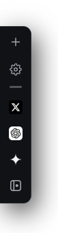
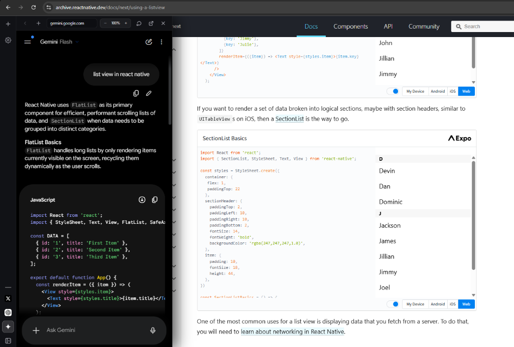

# EdgeBar ⚡ (The In-Browser Workspace Companion)

> **Sayfanızdan ayrılmadan dilediğiniz yapay zekayı (Gemini, ChatGPT), dokümantasyonu veya aramayı anında yanınıza getiren Arc & Raycast esintili ultra-hızlı dikey çalışma paneli.**

[](https://developer.chrome.com/docs/extensions/mv3/intro/)
[]()
[]()
[]()

<br/>

<p align="center">
  
  
</p>
<p align="center">
  <sub>✨ <b>Sol:</b> Sayfayı işgal etmeyen fasetli kompakt şerit &nbsp;•&nbsp; <b>Sağ:</b> Kod/doküman okurken tek tıkla kayarak açılan Gemini & AI paneli</sub>
</p>

---

## 🚀 Neden EdgeBar?

Geleneksel tarayıcılarda ChatGPT'ye bir soru sormak, Gemini'ye kod inceletmek veya hızlıca Google'da bir şey aratmak için sekmeler arasında kaybolursunuz. **EdgeBar**, tarayıcınızın sol kenarına entegre olan, gözü yormayan ve dilediğiniz an tek bir tıkla veya kısayolla kayarak açılan bağımsız bir mikro-çalışma alanıdır.

---

## 🌟 Öne Çıkan Özellikler

### 1. 📑 Dikey Kapanabilir Sekmeler (Arc & Edge Stili)
- **Sabit Kısayollar (Pinned Apps):** Gemini, ChatGPT, GitHub gibi en çok kullandığınız araçlar alt dock'ta sabit kalır; asla kaybolmaz veya üzerine yazılmaz.
- **Geçici Açık Sekmeler (Open Tabs):** `+` butonuyla açtığınız veya arama yaptığınız her sayfa sol sütunda geçici bir sekme olarak listelenir.
- **Hover ile Kapatma (`×`):** Sekmenin üzerine geldiğinizde beliren minimal kapat butonuyla işiniz biten sayfayı anında kapatabilirsiniz (arka plandaki iframe ve bellek anında temizlenir).

### 2. 🔍 Canlı Google Arama Önerileri (Autocomplete Engine)
- Yeni sekme ekranında Chrome/Raycast estetiğinde tasarlanmış merkezi Google arama kutusu yer alır.
- Harf yazmaya başladığınız anda **Google'ın resmi Suggest API'sinden anlık öneriler** açılır menüde listelenir.
- Klavyedeki **Yukarı/Aşağı ok tuşlarıyla** öneriler arasında gezinebilir, **Enter** ile anında sonuca gidebilirsiniz.

### 3. 🌐 Minimalist Arc / Raycast Adres Çubuğu
- Panelin üst kısmında anlık favicon gösteren kompakt ve şık bir URL çubuğu bulunur.
- İster bir web adresi yazın (`notion.so`), ister doğrudan arama yapın (`react hooks`); EdgeBar bunu otomatik algılar.
- **Geri Tuşu (`<`):** Sayfalar arasında gezinirken oturum geçmişini tutar ve tek tıkla önceki sayfaya ya da yeni sekme ekranına dönmenizi sağlar.

### 4. 🏝 3 Farklı Yükseklik Modu
- **↕ Tam (Full Viewport):** Ekranın sol kenarını boydan boya kaplayan derin odaklanma modu.
- **🏝 Ada (Floating Island):** Üstten ve alttan zarif boşluklar bırakan, yuvarlatılmış köşeli ada görünümü.
- **🎛 Serbest (Custom Height):** Üst kenarından dilediğiniz gibi yukarı/aşağı boyutlandırabildiğiniz serbest yükseklik.

### 5. 📑 Kompakt Kenar Şeridi (Zero-Distraction Dock)
- Panel kapalıyken bile favori ikonlarınız sol kenarda zarif fasetli bir şerit olarak hazır bekler; tek tıkla doğrudan o uygulamayı veya yapay zekayı açar. Sayfanızı veya içeriğinizi asla işgal etmez.

### 6. ↕ Serbest Dikey Konumlandırma
- Sol sütundaki tutamaçtan tutarak dock'u ekranın dilediğiniz yüksekliğine (yukarı/aşağı) sürükleyip bırakabilirsiniz. Tercihiniz tüm sekmelerde anında hatırlanır.

### 7. 🛡 Sıfır FOUC & %100 Shadow DOM İzolasyonu
- Eklentinin tüm HTML ve CSS kodları izole bir **ShadowRoot** içinde barınır.
- Ziyaret ettiğiniz hiçbir web sitesinin (Twitter, YouTube, Notion vb.) stilleri EdgeBar'ı bozamaz, EdgeBar da ana sayfayı asla etkilemez.
- `declarativeNetRequest` kuralları ile `X-Frame-Options` ve `CSP` kısıtlamaları güvenle bypass edilir.

---

## ⌨️ Klavye Kısayolları

| Kısayol | İşlev |
| :--- | :--- |
| `Alt + S` | Paneli Aç / Kapat (Tüm tarayıcıda geçerli) |
| `Esc` | Açık olan paneli veya ayarlar penceresini anında kapatır |
| `Enter` | Adres çubuğundaki URL'ye gider veya aramayı başlatır |
| `↓ / ↑ Oklar` | Google arama önerileri arasında gezinir |

---

## 🚀 Kurulum (Nasıl Yüklenir?)

1. Projeyi klonlayın veya ZIP olarak indirip klasöre çıkartın:
   ```bash
   git clone https://github.com/kemaladlig/edgebar.git
   ```
2. Chrome veya Edge tarayıcınızı açıp adres çubuğuna şunu yazın:
   ```text
   chrome://extensions
   ```
   *(Edge kullanıyorsanız: `edge://extensions`)*
3. Sağ üst köşedeki **Geliştirici Modu (Developer Mode)** anahtarını açın.
4. Sol üstte beliren **Paketlenmemiş öğe yükle (Load unpacked)** butonuna tıklayın.
5. İndirdiğiniz **`edgebar`** klasörünü seçin.
6. Hepsi bu kadar! `Alt + S` tuşlarına basarak veya sol kenardaki butona tıklayarak EdgeBar'ı hemen kullanmaya başlayabilirsiniz.

---

## 🛠 Mimari ve Performans Prensipleri

- **Sıfır Bağımlılık (Vanilla JS & CSS):** React, Vue veya harici kütüphane şişkinliği yoktur. Doğrudan tarayıcının yerel Web API'leriyle çalışır.
- **Tembel Yükleme (Lazy Loading):** Panel açılana kadar hiçbir iframe belleğe yüklenmez.
- **Bellek Temizliği (Garbage Collection):** Kapatılan sekmelerin iframe'leri DOM'dan anında silinir.
- **CPU 0% Idle:** Arkada sürekli çalışan hiçbir döngü veya dinleyici bulunmaz.

---

## 📄 Lisans

Bu proje **MIT** lisansı altında geliştirilmiştir. Dilediğiniz gibi özelleştirebilir ve kullanabilirsiniz.
